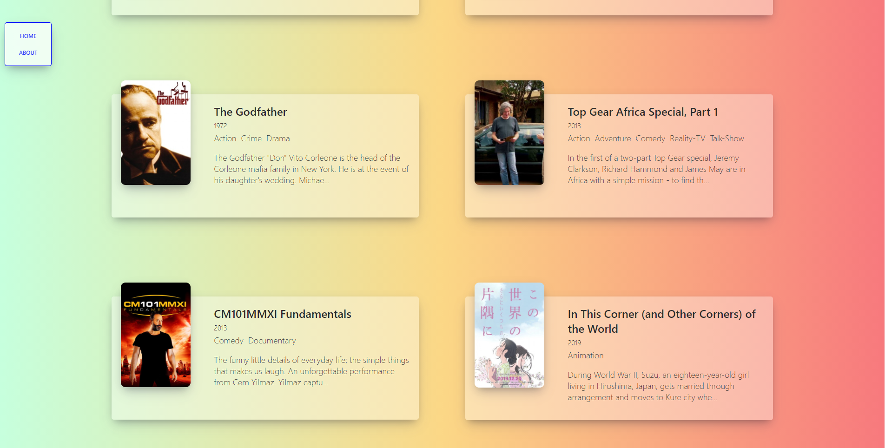
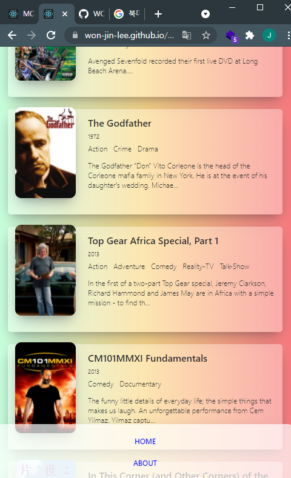

# Movies Web

## Project

- 프로젝트 : Movies Web By ReactJS(2021)
- 개요 : React로 영화 웹 제작
- 기술 : React, JavaScript, HTML, CSS
- 기간 : 21.09.03 ~ 21.09.16

### 주요 기능

- API로 영화 data를 받아와서 영화의 이미지와 제목, 제작년도 등 정보들을 보여줍니다.
- react-router-dom 패키지에서 HashRouter API를 이용해서 한 페이지에서 여러 Components들을 랜더링 가능하도록 작성하였습니다.
- Link API에서 to속성의 프로퍼티로 영화 데이터를 다른 Components로 Data share 가능합니다.

### Movies Web [Link](https://won-jin-lee.github.io/movies-web/)

---

## Wide Screen

## Small Screen

